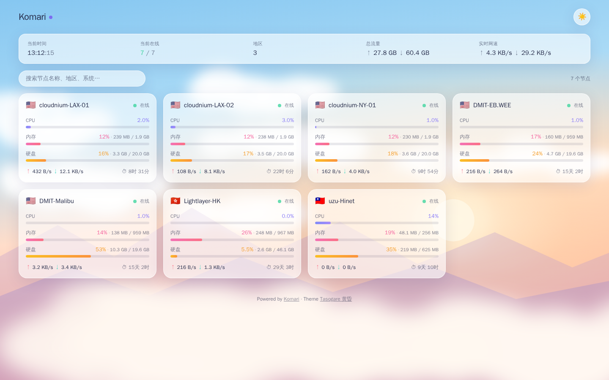
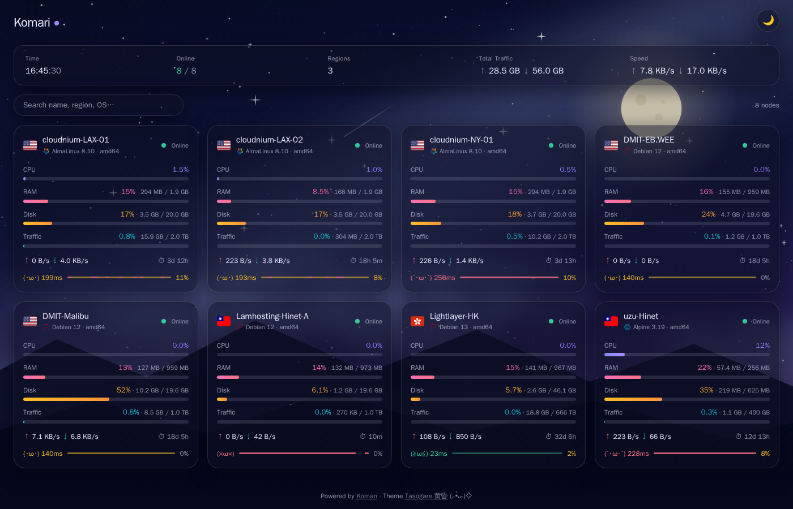
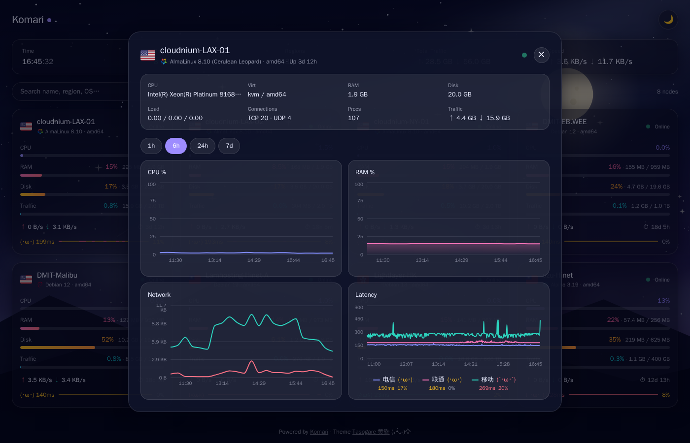

# Tasogare 黄昏 · Komari Theme

彩色玻璃拟态主题，白天与黑夜双壁纸，随一天流转。
A vibrant glassmorphism theme for [Komari](https://github.com/komari-monitor/komari), with day/night dual wallpapers.

| ☀️ Day | 🌙 Night |
| --- | --- |
|  |  |



## ✨ 特性 / Features

- **全屏壁纸 + 磨砂玻璃卡片** — 壁纸是主角，UI 是衬托 / Fullscreen wallpaper with frosted-glass cards
- **日夜双模式、双壁纸** — 白玻璃配白天，黑玻璃配星空；跟随系统，可手动切换 / Light & dark modes with separate wallpapers, follows system preference
- **开箱即用** — 内置手绘 SVG 天空壁纸（零版权风险），后台可替换为任意图片 URL / Built-in license-free SVG sky wallpapers, replaceable from the admin panel
- **实时数据** — 2 秒轮询，CPU / 内存 / 硬盘 / 流量配额彩色进度条，实时网速与在线时长 / Live stats every 2s, incl. traffic quota bar
- **延迟分级配色** — 绿 / 黄 / 红三档一眼看健康；悬停徽章展开各线路延迟与丢包 / Latency color tiers with per-ISP hover breakdown
- **账单信息** — 卡片到期倒计时徽章（≤15 天提醒），弹窗显示价格与到期日 / Expiry countdown badge & price info
- **玻璃弹窗详情** — CPU / 内存 / 网速历史曲线 + 多线路延迟图表（1h / 6h / 24h / 7d，含图例）/ Glass modal with history & multi-target latency charts
- **搜索与分组** — 分组筛选、模糊搜索、离线节点排序可配置 / Search, group filter, configurable offline sorting
- **克制的动效** — 入场缓动、夜空星光与偶发流星、日夜切换弹跳、卡片 3D 微倾斜；挂后台自动暂停，尊重 `prefers-reduced-motion` / Subtle motion incl. shooting stars & 3D tilt, pauses in background
- **中英双语** — 跟随浏览器语言 / Chinese & English, follows browser language
- 手机端自适应，弹窗变为底部抽屉 / Mobile friendly

## 📦 安装 / Install

1. 从 [Releases](../../releases) 下载 `komari-theme-tasogare.zip`
2. Komari 后台 → **设置 → 主题** → 上传 zip → 切换到 *Tasogare 黄昏*
3. 完成。想换壁纸？主题设置里填上你的图片 URL（白天/黑夜各一张）

Download the zip from Releases, upload it in **Admin → Settings → Theme**, switch to *Tasogare*. Done.

### 主题配置 / Theme options

| 配置项 | 说明 |
| --- | --- |
| 白天壁纸 URL | 亮色模式壁纸，留空用内置天空 |
| 黑夜壁纸 URL | 暗色模式壁纸，留空用内置星空 |
| 卡片显示平均延迟 | 需要先在后台配置延迟监控任务 |
| 丢包判定灵敏度 | 丢包变黄/变红阈值：Strict 3%/9% · Standard 5%/12%（默认）· Relaxed 10%/25%；全挂线路按 100% 丢包计入卡片平均 |
| 离线节点位置 | First / Keep / Last |

## 🛠 开发 / Development

```bash
npm install
npm run dev        # dev server on :5180, proxies /api to your Komari
npm run build      # production build
npm run package    # build + create theme zip
```

Edit `vite.config.ts` to point the proxy at your Komari instance.

## License

[MIT](LICENSE) · Wallpapers are original SVG artwork generated for this project, also MIT.
